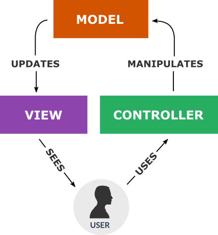
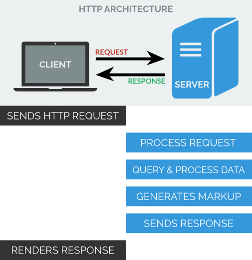
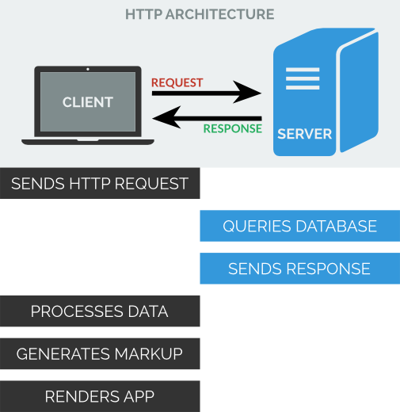

title: 
content_class: flexbox vcenter

__*Superheroic* JavaScript MVC. HTML *enhanced* for web apps!__

---

title:
content_class: flexbox vcenter

---

title:
content_class: flexbox vcenter

---

title: Traditional 'websites'
subtitle:
content_class: flexbox vcenter

---

title: Modern webapps
subtitle:
content_class: flexbox vcenter

---

title: What the AngularJS?
subtitle: Or, what superpowers?

* __Templating__ : HTML with additional markup

* __Model__ : The data that the user interacts with

* __Scope__ : Context where the model is stored

* __View__ : What the user sees, i. e. the DOM

* __Data Binding__ : Sync data between _model_ and _view_

* __Controllers__ : The business logic behind views

* __Service__ : Reusable business logic, independent of views