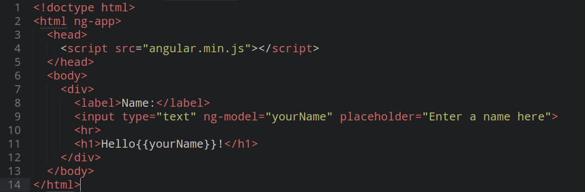
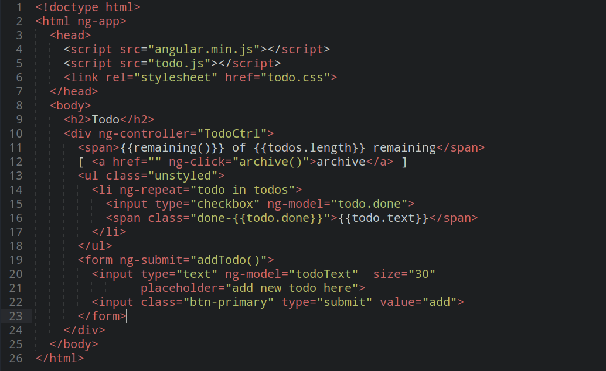
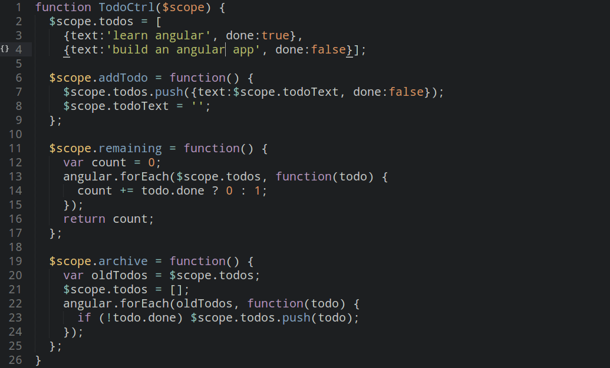

title: 
content_class: flexbox vcenter

__*Superheroic* JavaScript MVC. HTML *enhanced* for web apps!__

---

title: Traditional 'websites'
subtitle:
content_class: flexbox vcenter

---

title: Traditional 'websites'

* Multiple-page navigation

* Mainly asynchronous, small parts synchronous

* Resources have to be fetched and rendered on every request

* Client just renders HTML and CSS, and processes *some* JavaScript

* User has to wait for the server's response after each interaction

* Slow user experiece (UX)

* The server hates you :-(

---

title: 
content_class: flexbox vcenter

---

title: Modern webapps
subtitle:
content_class: flexbox vcenter

---

title: Modern webapps

* Single-page navigation

* Largely asynchronous

* Resources have to be fetched and rendered only once

* Client makes API calls to the server, gets *only* data in response

* Client *generates* markup, and does a *lot* of JavaScript

* User only wait for data-fetches

* Fast user experience (UX)

* The server loves you &hearts;

---

title: 
content_class: flexbox vcenter

---

title:
content_class: flexbox vcenter

---

title:
content_class: flexbox vcenter

---

title: What the AngularJS?
subtitle: The superpowers!

* __Templating__ : HTML with additional markup

* __Model__ : The data that the user interacts with

* __Scope__ : Context where the model is stored

* __View__ : What the user sees, i. e. the DOM

* __Data Binding__ : Sync data between _model_ and _view_

* __Controllers__ : The business logic behind views

* __Service__ : Reusable business logic, independent of views

---

title: Hello, world!

---

title: Hello, world!

<iframe src="partials/hello-world.html" frameborder="0"></iframe>

---

title: Data Binding

---

title: Data Binding

<iframe src="partials/data-binding.html" frameborder="0"></iframe>

---

title: Data Binding
subtitle: Behind the scenes
content_class: flexbox vcenter

---

title: Let's create some stuff!
subtitle: How about a to-do list?
class: segue dark nobackground

---

title: todo.html
class: nobackground

---

title: todo.js
class: nobackground

---

title: To do? Ta da!

<iframe src="partials/todo.html" frameborder="0"></iframe>

---

title: Demo time!
subtitle: AngularJS in action.
class: segue dark nobackground

---

title:
class: fill
content_class: flexbox vcenter centered

<h1 style="font-size: 400%">I &hearts; questions!</h1>